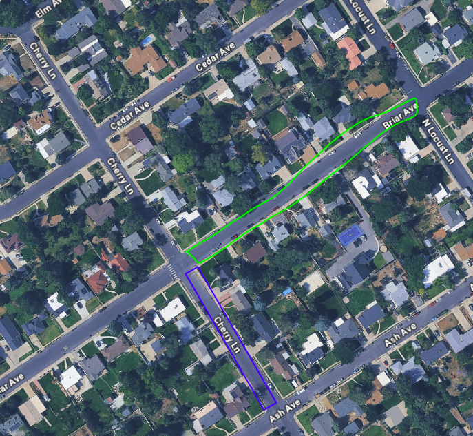

## Licensure

The flyer must hold a Part 107 license, or have someone actively watching who holds a Part 107 license.

## General Drone Information

Photos are saved in a folder named `DCIM`. Each flight is saved using the following filename format:

`DJI_[date/time]_[flight number]_[flight plan name]`

| Segment | Meaning |
|---|---|
| `DJI` | Name of the drone used |
| First number string | Date and time the flight was run, as `YYYY/MM/DD/HH/MM` |
| Second number string | Flight number, counted from the very first flight |
| Last string | Name of the flight plan used to take the pictures |

::: {.callout-note}
Ignore the `MRK` file unless you know for a fact that you're using an RTK setup with only one set of pictures. Otherwise, it's useless.
:::

## Naming Conventions 

### Naming Missions

Follow this format: `Street1_Street2`

- **Street1** — the street you are flying the drone down.
- **Street2** — the street to the south or west that you are flying, depending on whether the road runs N-S or E-W.
  - For roads not laid out N-S or E-W, use the most western or southern street, respectively.
- The Flight Planner will add information about the height, gimbal pitch, and photo overlap to the end. 

#### Examples

| Section | Mission Name |
|---|---|
| Red | `100N_400E` |
| Purple | `500E_Center` |
| Green | `Brair_Cherry` |
| Blue | `Cherry_Ash` |

::: {.columns}

::: {.column width="50%"}
{height="300px"}
:::

::: {.column width="50%"}
{height="300px"}
:::

:::

### Naming Photo Folders

Name the photo folder after the mission it's composed of (the nadir and oblique flights combined).
This should result in a unique name for every folder. 

## Flight Planning

### TODO

TO DO: We need to figure out the best overlap for the correct number of images. If 1280 is the depth we are going for in the extractor, we need to limit the photos or we'll have to deal with large processing times.

### General Notes

- Keep flight photo number relatively low so that analysis doesn't take a long time. (The overlap will determine if enough pictures are being taken for the houses.)
- DJI Fly controllers struggle with a lot of waypoints — 80+ waypoints causes some issues, and more than 99 really slows it down.
- Leave at least 30 seconds between flights. This ensures the photo sorter doesn't combine separate flights together. 

### Flight Paths

The flight path that you will draw will be determined by the type of street you are on. 
In general:

- We have two flights per road section, named a flight set. One at ~70 feet and another at ~200 feet. The first is for the image analysis, the second is for the point cloud maker. 
- The flight path should travel along the shoulder of the road, between the traveled way and parking strip/sidewalk. This reduces the likelyhood of flying over a person, which part 107 doesn't allow.
- Keep the paths reasonable and logical. One flight set should focus on a single road section, as seen in the naming examples. 
Since more images means the point cloud maker takes longer, when it doubt, make it shorter. 
- Do you best to avoid flying on private property. 

#### Residential/Local Roads
- Regular

- Curved Road

#### Arterial/Busier Roads
- Do not have the drone fly over it, like we do with residential. 

#### Big Buildings and Parking lots
These, such as stores or church buildings, typically can't follow the standard flight set. 
We need to see if we put together a flight set for these kinds of buildings. 
200 feet higher flights should work no problem. 

#### Roundabouts
Roundabouts are their own road section. 

#### Empty Lots/Fields

We do not need to run flights covering these areas. We're concerned about buildings only. 

### Heights and Angles

These are the heights and angles that have been found to work well for flight paths. This list will update and expand as needed.

| Height (ft) | Location | Angle (°) | Overlap |
|---|---|---|---|
| 70 | Across Street | 40 | ? |
| 200 | Across Street | 72 | ? |

::: {.callout-note}
Overlap values are still to be determined for both flight profiles.
:::

