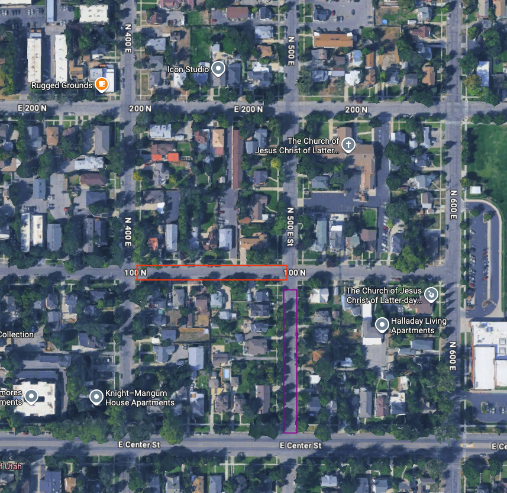
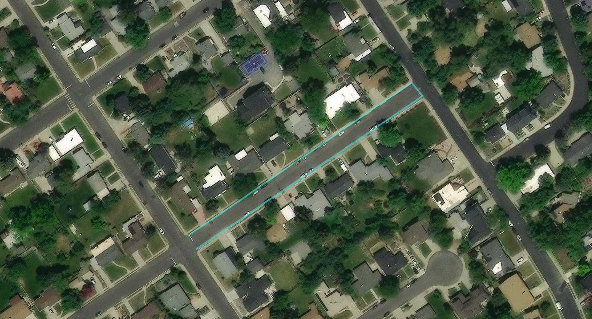
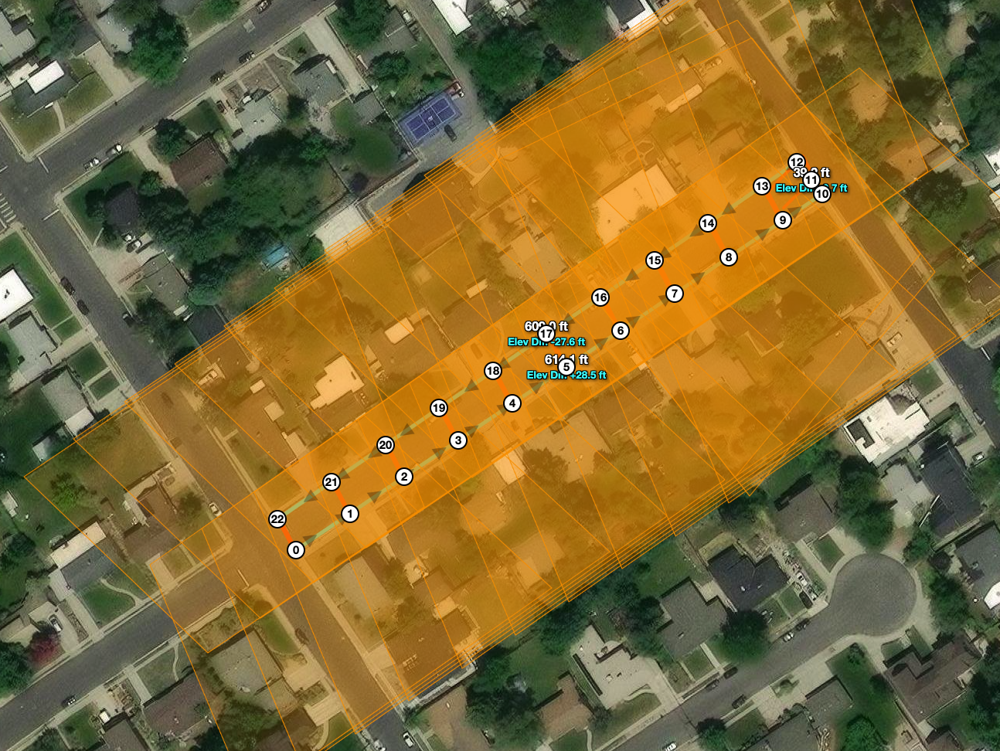
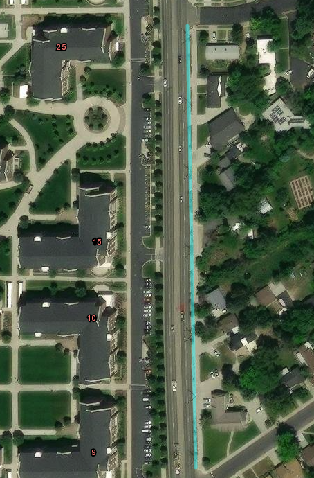
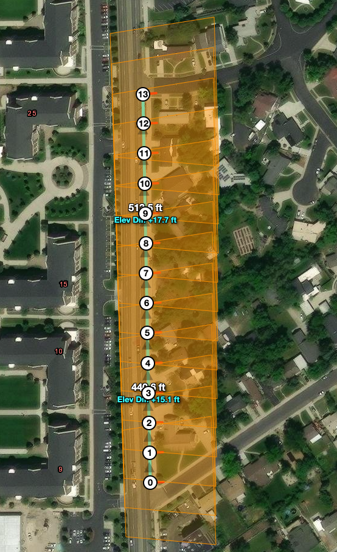

[To research pages](https://cojow.github.io/flight_planner/BYU_Specific_information/)

## Certificate {#sec-licensure}

The flyer must hold a Part 107 Certificate, or have someone actively watching who holds a Part 107 certificate. See the page [here](https://cojow.github.io/flight_planner/BYU_Specific_information/part_107.html) for information about getting your certificate.

## Naming Conventions 

### Photo Naming

Photos are saved in a folder named `DCIM`. Each flight is saved using the following filename format:

`DJI_[date/time]_[flight number]_[flight plan name]`

| Segment | Meaning |
|---|---|
| `DJI` | Name of the drone used |
| First number string | Date and time the flight was run, as `YYYY/MM/DD/HH/MM` |
| Second number string | Flight number, counted from the very first flight |
| Last string | Name of the flight plan used to take the pictures |

DJI Fly drones (the Mini series that we are using) save all of their photos into a single DCIM folder, not separated by flight plans like DJI Pilot 2 drones. This is why the [flight planner](https://github.com/cojow/flight_planner) has a dedicated tab for separating the photos.

::: {.callout-note}
Ignore the `MRK` file unless you know for a fact that you're using an RTK setup with only one set of pictures. Otherwise, it's useless.
:::

### Naming Missions {#sec-naming-missions}

Follow this format: 

`Street1_Street2`

| Segment | Meaning |
|---|---|
| **Street1** | The street you are flying the drone down. |
| **Street2** | The street to the south or west that you are flying, depending on whether the road runs N-S or E-W. |

*For roads not laid out N-S or E-W, use the most western or southern street, respectively. 
*If a street ends (like in a cul-de-sac), use "END" for Street2. 

The Flight Planner will add information about the height, gimbal pitch, and photo overlap to the end. 

#### Examples

| Section | Mission Name |
|---|---|
| Red | `100N_400E` |
| Purple | `500E_Center` |
| Green | `Brair_Cherry` |
| Blue | `Cherry_Ash` |

::: {.columns}

::: {.column width="50%"}
{height="400px"}
:::

::: {.column width="50%"}
{height="400px"}
:::

:::

### Naming Photo Folders {#sec-naming-photo-folders}

Name the photo folder after the mission it's composed of (the nadir and oblique flights combined).
This should result in a unique name for every folder. 

This can be done in the photo sorter if you know the sequence you did the flights in (ideal), or afterwards manually for each folder. 

## Flight Planning

::: {.callout-note}
**TO DO: We need to figure out the best overlap for the correct number of images. If 1280 is the depth we are going for in the extractor, we need to limit the photos or we'll have to deal with large processing times.**
::: 

### General Notes

- Keep the flight photo count relatively low so that analysis doesn't take a long time. (The overlap will determine if enough pictures are being taken for the houses.)
- DJI Fly controllers struggle with a lot of waypoints — 80+ waypoints cause some issues, and more than 99 really slows it down.
- Leave at least 30 seconds between flights. This ensures the photo sorter doesn't combine separate flights together. 

### Flight Paths {#sec-flight-paths}

The flight path that you will draw will be determined by the type of street you are on. 
In general:

- We have two flights per road section, together called a flight set. One at ~70 feet and another at ~200 feet. The first is for the image analysis, the second is for the point cloud maker. 
- The flight path should travel along the shoulder of the road, between the traveled way and parking strip/sidewalk. This reduces the likelihood of flying over a person, which Part 107 doesn't allow.
- Keep the paths reasonable and logical. One flight set should focus on a single road section, as seen in the naming examples. 
Since more images means the point cloud maker takes longer, when in doubt, make it shorter. 
- Do your best to avoid flying on private property. (We might want to make cards to give to people who question what we are doing. I've had a couple people inquire, and I've done a small number of flights compared to what we will do.)

#### Residential/Local Roads
- Regular (30 to 40 feet)

- Curved Road

 

#### Arterial/Busier Roads
- Do not have the drone fly over it, like we do with residential. 
- 60+ Feet wide???

::: {.columns}

::: {.column width="50%"}
{height="550px"}
:::

::: {.column width="50%"}
{height="550px"}
:::

:::
#### Big Buildings and Parking Lots
These, such as stores or church buildings, typically can't follow the standard flight set. 
We need to see if we can put together a flight set for these kinds of buildings. 
200 feet elevation flights should work no problem. 

#### Cul-de-sac
Roundabouts are their own road section. They're difficult to draw a flight path in due to the path being made of lines. They also have wider road sections. Might be best to either have the drone on the same side or in the middle of the cul-de-sac. See @sec-heights-and-angles.

#### Empty Lots/Fields

We do not need to run flights covering these areas. We're concerned about buildings only. 

### Heights and Angles {#sec-heights-and-angles}

These are the heights and angles that have been found to work well for flight paths. 
This list will update and expand as we fly missions. 
We will need to verify these numbers in the field. 

| Height (ft) | Street Width | Drone Location | Angle (°) | Overlap |
|---|---|---|---|---|
| 70 | 30 - ? | Across Street | 40 | >75 |
| 200 | 30 - ? | Across Street | 72 | >75 |
| 70 | 60 - ? | Same Side | 35? | >75 |
| 200 | 60 - ? | Same Side | 80? | >75 |

*Is it better to use road type, or street width? A combination of both?

::: {.callout-note}
Overlap values are still to be determined/verified for all flight profiles.
:::

## Mission Saving

### Mission Folders

By default missions are saved in the root folder `missions` in the same folder as `app.py`. To keep it organized, we want to create a new folder in the missions folder for each area of flights. I'm not sure if we should name them after bounding streets (e.g. 700N_Center_university_700E), notable arterials (e.g. 700N_Center), common names (e.g. Joaquin), numbered sections (e.g. 1,2,3), etc. We will figure this out in a future meeting. 

All missions should be uploaded to the Box folder when they are flown so that we can keep track of them with the flight tracker. See @sec-flight-tracker.

### Uploading {#sec-uploading}

See the [DJI Fly Transfer](https://cojow.github.io/flight_planner/#dji-fly-transfer) section in the README for how to upload missions to the drone. 

## Pre Flight Checklist

For DJI Mini series drones (DJI Fly). 

### Before Flights

#### Legal & Registration

- [ ] You hold a current Part 107 certificate, or someone with one is actively watching. See @sec-licensure.
- [ ] Certificate (temporary printout or plastic card) is on you.
- [ ] The specific drone you're flying is registered at FAADroneZone under **Part 107**, with the N-number marked visibly on the outside.
- [ ] Remote ID is active on the aircraft.

::: {.callout-note}
There is no 250 g exemption under Part 107, so the Minis all need to be registered even though a recreational flyer could skip it.
:::

#### Missions Built

- [ ] A full flight set exists for each road section — one at ~70 ft and one at ~200 ft. See @sec-flight-paths.
- [ ] Gimbal pitch matches the height for that flight. See @sec-heights-and-angles.
- [ ] Every mission is **under 99 photos**. 
- [ ] Paths run along the road shoulder, not over the traveled way or private property.
- [ ] Missions are named according to @sec-naming-missions.
- [ ] Airspace checked with **Show FAA Airspace Restrictions** in the Creator, and LAANC filed if the ceiling requires it.

::: {.callout-important}
LAANC cannot be submitted from the Flight Planner — you have to file it in another app before you fly.
:::

#### Transferred to the Controller

- [ ] Controller powered on and connected to the computer by USB.
- [ ] Preview (Mac), Android File Transfer, and any other MTP tools are **closed** — they hold the USB device and block the transfer.
- [ ] Missions pushed across with the DJI Fly Transfer tab. See @sec-uploading.
- [ ] Load each mission on the controller, back out to the mission history page, and press save.
- [ ] Missions confirmed against the checklist at the bottom of the DJI Fly Transfer tab.

::: {.callout-important}
The controller shows missions as long random strings, not names. The thumbnail is the only practical way to tell them apart in the field, and it does not update on its own — if you skip the refresh you will not know which mission is which.
:::

### On Site

#### Gear

- [ ] Drone and controller batteries charged, plus spares.
- [ ] SD card in the drone with free space, and the previous outing's photos already offloaded.
- [ ] Propellers checked for chips or cracks.

#### Before Takeoff

- [ ] Daylight, clear visibility, wind within the aircraft's limits.
- [ ] No bystanders under the flight path.
- [ ] Correct mission selected — check the thumbnail.
- [ ] **Take off as close as possible to the first waypoint.**

::: {.callout-important}
Waypoint altitudes are relative to wherever the drone takes off, not to the mission or to sea level. Launching from a spot noticeably higher or lower than the first waypoint shifts the whole flight up or down by that difference.
:::

#### Between Flights

- [ ] At least **30 seconds** between flights. The Photo Sorter splits flights on time gaps, so back-to-back flights get merged into one folder.
- [ ] Record the order you fly the missions in. It makes naming the groups in the Photo Sorter much faster afterwards.

### After Flights

- [ ] Photos pulled off and split with the Photo Sorter.
- [ ] Folders named after their mission. See @sec-naming-photo-folders.
- [ ] Missions uploaded to Box so the flight tracker picks them up. See @sec-flight-tracker.
- [ ] Photos uploaded to Box folder.

## Companion Apps

### Flight Tracker {#sec-flight-tracker}

The flight tracker is a companion app to the flight planner. It runs independently of it, but is downloaded from GitHub along with it. See the documentation [here](https://cojow.github.io/flight_planner/BYU_Specific_information/flight_tracker.html) to learn how to use it. 

### Box

Here is a [link](https://byu.box.com/s/0tkvvoe2zg9b682r8vaxjwa2mwazyday) to the Box folder that we will use to organize all flight plans, taken photos, and annotated photos. If you should have access but don't, contact Connor Williams (willicon@byu.edu).