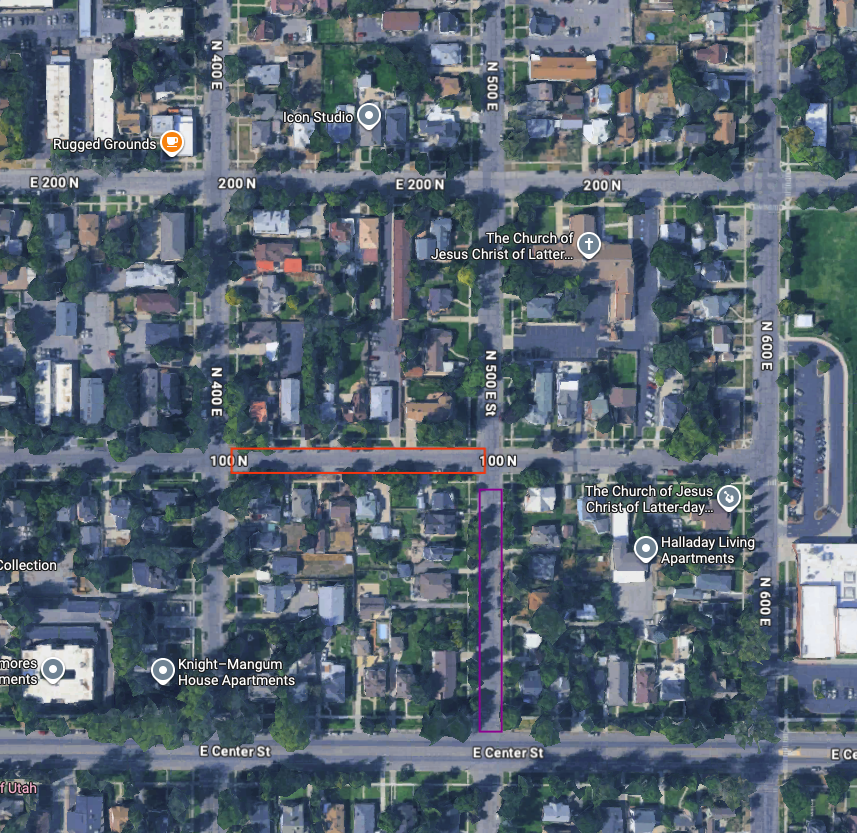
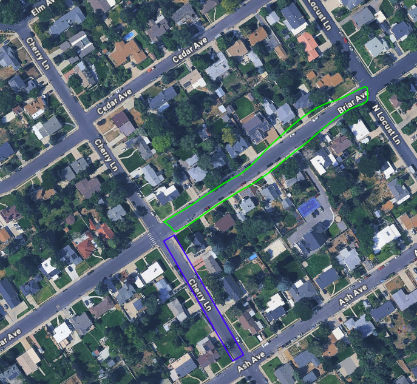
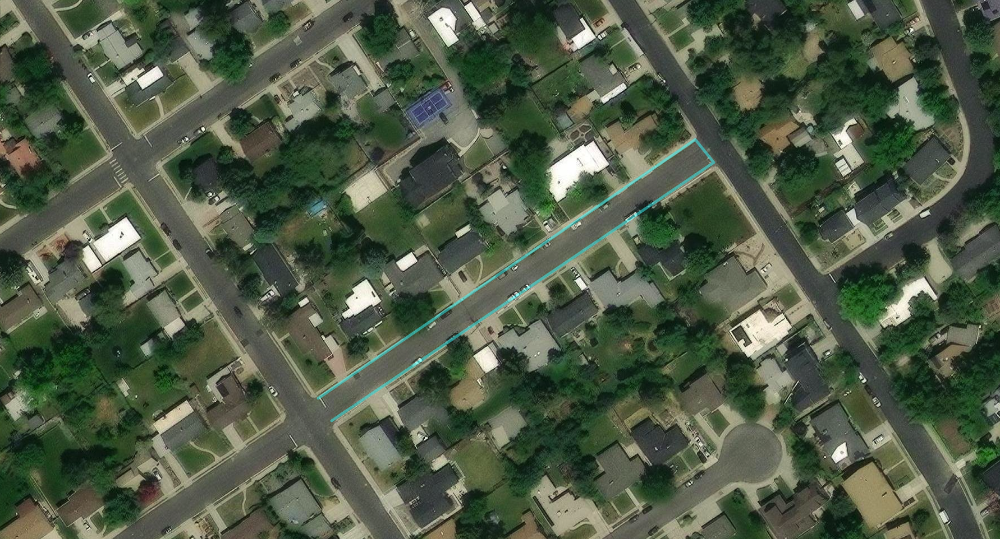
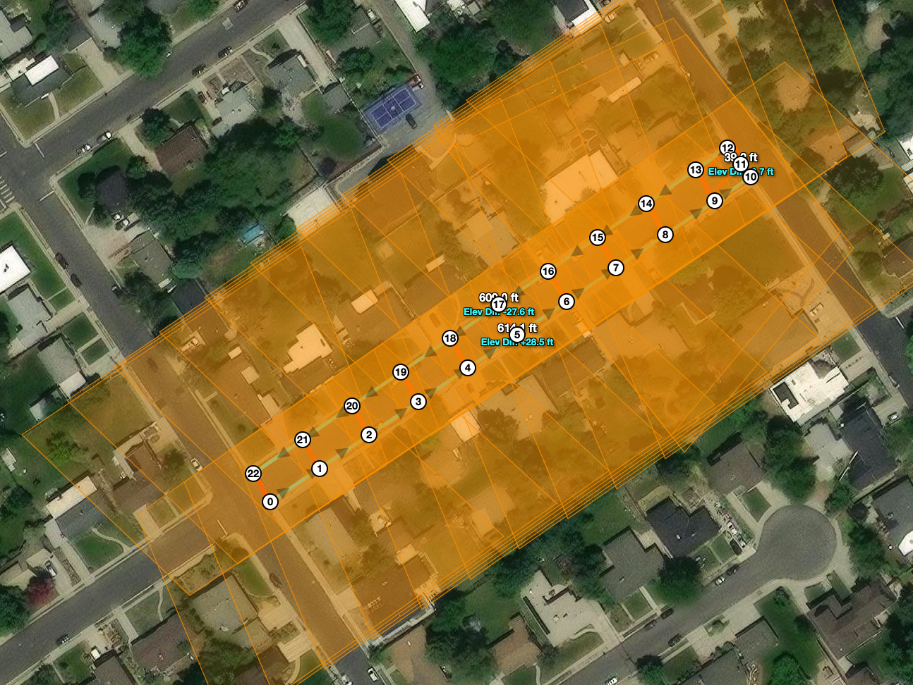
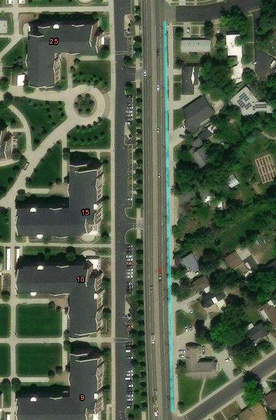
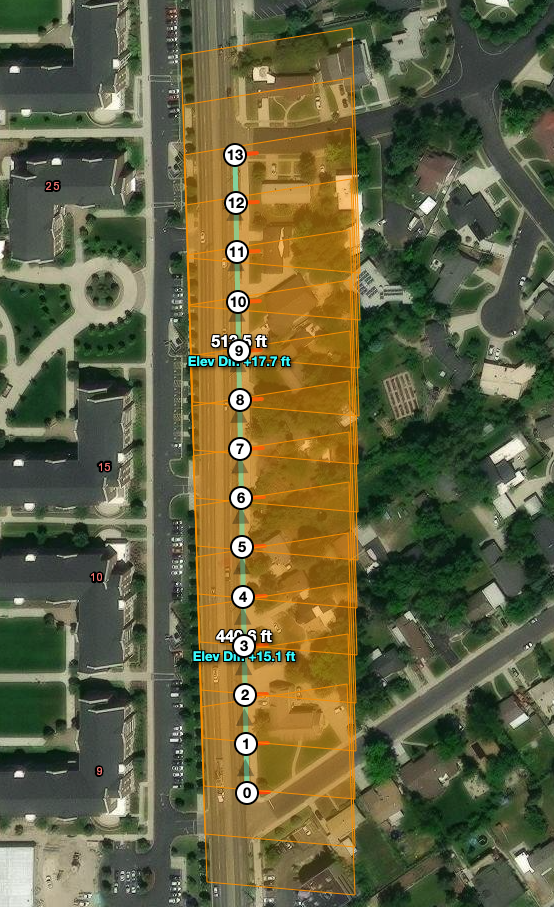
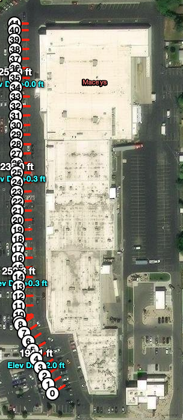
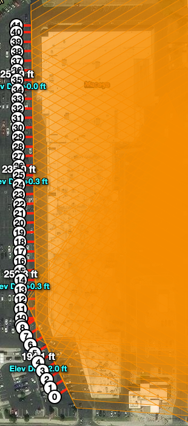
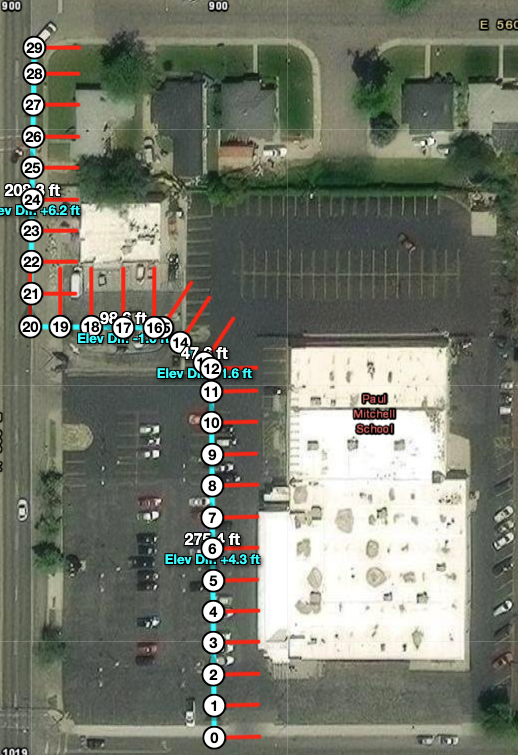
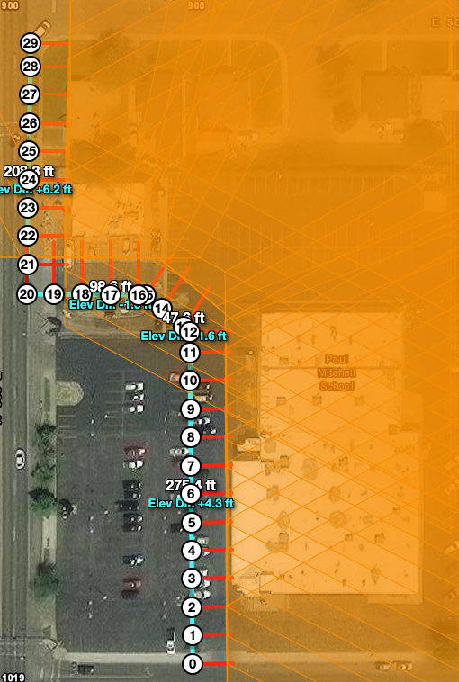

[To research pages](https://cojow.github.io/flight_planner/BYU_Specific_information/)

## Licensure/Certificate {#sec-licensure}

The flyer must hold a Part 107 Certificate (commonly called a license), or have someone actively watching who holds a Part 107 certificate. See the page [here](https://cojow.github.io/flight_planner/BYU_Specific_information/part_107.html) for information about getting your certificate.

## Naming Conventions {#sec-naming}

### Photos {#sec-photos}

Photos are saved in a folder named `DCIM`. Each flight is saved using the format below, you will not need to edit the names. 

* DJI Pilot Drones: `DJI_[date/time]_[flight number]_[flight plan name]`
* DJI Fly Drones: `DJI_[date/time]_[flight number]_D`

| Segment | Meaning |
|---|---|
| `DJI` | Name of the drone used |
| `[date/time]` | Date and time the flight was run, as `YYYY/MM/DD/HH/MM` |
| `[flight number]` | Flight number, counted from the very first flight |
| `[flight plan name]` | Name of the flight plan used to take the pictures |
| `D` | Ignroe it, every picture has it |

DJI Fly drones (the Mini series that we are using) save all of their photos into a single DCIM folder, not separated by flight plans like DJI Pilot 2 drones. This is why the [flight planner](https://github.com/cojow/flight_planner) has a dedicated tab for separating the photos.

::: {.callout-note}
Ignore the `MRK` file unless you know for a fact that you're using an RTK setup with only one set of pictures. Otherwise, it's useless. The DJI Fly drone doesn't even make this file. 
:::

### Mission Folders {#sec-mission-folders}

By default missions are saved in the root folder `missions` in the same folder as `app.py`. 
To keep it organized, we want to create a new folder in the missions folder for each area of flights. 
For now, we will name each folder after the bounding streets of the area. 
The name will be long, but it will be descriptive. 

All missions should be uploaded to the Box folder when they are flown so that we can keep track of them with the flight tracker. See @sec-flight-tracker.

### Missions {#sec-naming-missions}

Follow this format when naming individual missions: 

`Street1_Street2`

| Segment | Meaning |
|---|---|
| **Street1** | The street you are flying the drone down. |
| **Street2** | The street to the south or west that you are flying, depending on whether the road runs N-S or E-W. |

*For roads not laid out N-S or E-W, use the most western or southern street, respectively. 

*If a street ends (like in a cul-de-sac), use "END" for Street2. cul-de-sac are flown in a separate mission. 

The Flight Planner will add information about the height, gimbal pitch, and photo overlap to the end. 

#### Examples

| Section | Mission Name |
|---|---|
| Red | `100N_400E` |
| Purple | `500E_Center` |
| Green | `Brair_Cherry` |
| Blue | `Cherry_Ash` |

::: {.columns}

::: {.column width="50%"}
{height="400px"}
:::

::: {.column width="50%"}
{height="400px"}
:::

:::

### Photo Folders {#sec-naming-photo-folders}

Name the photo folder after the mission it's composed of, nadir and oblique flights, with the prefix "photo".
This should result in a unique name for every folder. 
To maintain consistency, the photo will be group in area folders like the missions. 
These area folders will have the same name as the missions, but with the prefix "**photo**".

This can be done in the photo sorter if you know the sequence you did the flights in (ideal), or manually afterwards sorting for each folder. 

## Flight Planning {#sec-flight-planning}

### Flight Sets {#sec-flight-sets}

Each road section will get a **flight set**: two flights that will follow the same path. One is at 70 feet and is used for analysing houses. The second is at 200 feet and it used to compute volumes of the house. 

### Flight Paths {#sec-flight-paths}

The flight path that you draw will be determined by the type of street you are on.
In general:

- The flight path should travel along the shoulder of the road, between the traveled way and parking strip/sidewalk. This reduces the likelihood of flying over a person, which Part 107 doesn't allow.
- Which side of the street to fly on depends on the road type (see the sections below). 
On most local roads, that means flying the far shoulder and looking across the street at the houses.
- Keep the paths reasonable and logical. One flight set should focus on a single road section, as seen in the naming examples.
Since more images means the point cloud maker takes longer, when in doubt, make it shorter.
- Do your best to avoid flying on private property.
- When roads are curved, do your best to follow the curves with the straight lines.
But don't go overboard with the small line segments, the drone likely won't do well.

See the sections below for specific guidance on each road type.

| Road Type | Section|
|---|---|
| Local Roads | @sec-local-roads |
| Busy/Arterial Roads|@sec-big-roads |
| Big Buildings and Parking Lots | @sec-big-buildings |
| Cul-de-sac | @sec-cul |
| Empty Lots/Fields | @sec-empty |

#### Residential/Local Roads {#sec-local-roads}

**What it is:** The most common road type, usually 30 to 40 feet wide.
- Flying the road across the street from where you are taking the pictures has seen the best results in capturing the fronts of the houses.

**Where to fly:** On the far shoulder, looking across the street at the houses. This has given the best captures of house fronts so far.

#### Busy/Arterial Roads {#sec-big-roads}
**What it is:** Less common, but houses and buildings still front onto them. Usually 50 to 60+ feet wide.
- Do not have the drone fly over it, like we do with local roads.
This means that there will be double the flight missions per flight set (two for each side of the road).

**Where to fly:** We will either stay on the same side or across, like local roads. We need to confirm the best angle for either one. 

::: {.columns}

::: {.column width="50%"}
{height="550px"}
:::

::: {.column width="50%"}
{height="550px"}
:::

:::

#### Big Buildings and Parking Lots {#sec-big-buildings}
**Where to fly:** In the parking lot rather than on the road, since these buildings usually sit behind one.
- We only need the front of the building for our picture analysis, so don't we won't need to worry about the back of the buildings.

**What to capture:** Only the front of the building matters for image analysis, so the back can be skipped. The 200 ft flight still has to capture the whole building for the point cloud.
- We need to put together a flight set for these kinds of buildings, since they are much larger then normal buildings.
- We may need to have our own naming conventions for big buildings like this.

Two possible layouts, both at 70 ft height, 40° pitch, and 75% overlap:

::: {.columns}

::: {.column width="50%"}

:::

::: {.column width="50%"}

:::

:::

::: {.columns}

::: {.column width="50%"}

:::

::: {.column width="50%"}

:::

:::

#### Cul-de-sac {#sec-cul}
Cul-de-sacs are their own road section. The round end is hard to follow with straight flight lines, and it is wider than the road leading into it. Split them into two flight sets: one for the approach road, which follows that road's type, and one for the circle, which gets its own gimbal pitch. Confirm the best pitch for the circle in the field.

#### Empty Lots/Fields {#sec-empty}

- We do not need to run flights covering these areas. We're concerned about buildings only.
If they aappear between buildings on a street, it will be left up to your engineering judgement to keep have the flight cover them or to split the flight in two. 

### Heights and Angles {#sec-heights-and-angles}

These are the standardized height and angles for each flight. 

200 feet is a good height to collect the tops of houses to create the point clouds, with some slight gimbal adjustments.
70 feet is a good height to see the front of a house, but the gimbal may need to be adjusted for certain areas. 

Angles are measured with 90° as straight down. DJI Fly shows the same pitch as a negative number, so 63° in this table is −63° in the app.

The following table outlines the pitch needed for each flight height and distance to the building.

::: {.callout-note}

These numbers appear to accomplish what we want, but we may adjust them as we fly the drones. 
:::

**70 ft flights**

| Height (ft) | Angle (°) | Overlap | Note |
|---|---|---|
| 70 | 45 | >75 | Opposite side of the street |

**200 ft flights**

| Height (ft) | Angle (°) | Overlap | Note |
|---|---|---|
| 200 | 70 | >75 | Opposite side of the street. 65 degrees may be better. |

We still need to verify which overlap will work for what we need. 
These tables may be added to if we find that wider streets present a problem. 

### Mission Size Limits {#sec-mission-limits}

Keep photo counts low so processing stays fast; overlap, not photo count, is what decides whether the houses are covered. On DJI Fly, each photo is a waypoint. Controllers start having trouble above 80 waypoints and slow down badly past 99, so split any mission over 80 into two.

### Uploading {#sec-uploading}

See the [DJI Fly Transfer](https://cojow.github.io/flight_planner/#dji-fly-transfer) section in the README for how to upload missions to the drone.

## Pre Flight Checklist

For DJI Mini series drones (DJI Fly).
Download the printable checklist as a PDF [here](https://cojow.github.io/flight_planner/BYU_Specific_information/flight_checklist.pdf).

### General

#### Legal & Registration

- [ ] You hold a current Part 107 certificate, or someone with one is actively watching. See @sec-licensure.
- [ ] Certificate (temporary printout or plastic card) is on you.
- [ ] The specific drone you're flying is registered at FAADroneZone under **Part 107**, with the N-number marked visibly on the outside.
- [ ] Remote ID is active on the aircraft.

::: {.callout-note}
There is no 250 g exemption under Part 107, so the Minis all need to be registered.
:::

### Before Flights

#### Gear

- [ ] Drone and controller batteries charged, plus spares.
- [ ] SD card in the drone with free space, and the previous outing's photos already offloaded.
- [ ] Propellers checked for chips or cracks.

#### Missions Built

- [ ] A full flight set exists for each road section. One at ~70 ft and one at ~200 ft. See @sec-flight-paths.
- [ ] Gimbal pitch matches the height for that flight. See @sec-heights-and-angles.
- [ ] Every mission is **under 99 photos**. 
- [ ] Paths run along the road shoulder, not over the traveled way or private property.
- [ ] Missions are named according to @sec-naming-missions.
- [ ] Airspace checked with **Show FAA Airspace Restrictions** in the Creator, and LAANC filed if the ceiling requires it.

::: {.callout-important}
LAANC cannot be submitted from the Flight Planner — you have to file it in another app before you fly.
:::

#### Transferred to the Controller

- [ ] Controller powered on and connected to the computer by USB.
- [ ] Preview (Mac), Android File Transfer, and any other MTP tools are **closed**. Won't work if they are open. 
- [ ] Missions pushed with the DJI Fly Transfer tab. See @sec-uploading.
- [ ] Load each mission on the controller, back out to the mission history page, and press save.
- [ ] Missions confirmed against the checklist at the bottom of the DJI Fly Transfer tab.

::: {.callout-important}
The controller shows missions as long random strings(on app) or date/time(on controller), not names. The thumbnail is the only practical way to tell them apart in the field, and it does not update on its own. If you skip the refresh you will not know which mission is which.
:::

### On Site Before Takeoff

#### Drone Check

- [ ] Insert a charged battery and confirm it clicks/locks in place
- [ ] Battery is securely in its slot. If it is not, it may slide out in the air. 
- [ ] Daylight, clear visibility, wind within the aircraft's limits.
- [ ] Note any potential obsticals or things that may interfear with the flight plan. 
- [ ] No bystanders under the flight path.
- [ ] Correct mission selected — check the thumbnail.
- [ ] **Take off as close as possible to the first waypoint.**

#### Start Up Check

- [ ] Power on the RC first, then power on the drone
- [ ] Open flight app and confirm live video feed is active
- [ ] Wait for GPS lock — confirm satellite count is 8 or higher
- [ ] Check compass and IMU calibration status — recalibrate if prompted
- [ ] Set Return-to-Home altitude above the tallest obstacle in the flight path
- [ ] Check RC signal strength and confirm controls are responding
- [ ] Arm motors briefly to confirm all props spin freely and evenly
- [ ] Do a low 6-foot hover for 10–15 seconds to check stability before flying out

::: {.callout-important}
Waypoint altitudes are relative to wherever the drone takes off, not to the mission or to sea level. Launching from a spot noticeably higher or lower than the first waypoint shifts the whole flight up or down by that difference.
:::

#### Between Flights

- [ ] Keep atleast **30 seconds** between flights. The Photo Sorter splits flights on time gaps, so back-to-back flights get merged into one folder.
- [ ] Keep a record of the order you fly the missions in. It makes naming the groups in the Photo Sorter much faster afterwards.

### After Flights

- [ ] Photos pulled off and split with the Photo Sorter.
- [ ] Folders named after their mission. See @sec-naming-photo-folders.
- [ ] Missions uploaded to Box so the flight tracker picks them up. See @sec-flight-tracker.
- [ ] Photos uploaded to Box folder.

## Companion Apps

### Flight Tracker {#sec-flight-tracker}

The flight tracker is a companion app to the flight planner. It runs independently of it, but is downloaded from GitHub along with it. See the documentation [here](https://cojow.github.io/flight_planner/BYU_Specific_information/flight_tracker.html) to learn how to use it. 

### Box

Here is a [link](https://byu.box.com/s/0tkvvoe2zg9b682r8vaxjwa2mwazyday) to the Box folder that we will use to organize all flight plans, taken photos, and annotated photos. If you should have access but don't, contact Connor Williams (willicon@byu.edu).

#### Structure

The Box folder is divided into 4 subdirectories. See  for naming conventions not mentioned here. 

- Flight Missions: This folder will hold the flight plans of all flown missions. 
Mission area folders may be placed directly into here with all missions inside of them. 
This will keep it organized, and allow the flight tracker to work. See @sec-mission-folders and @sec-naming-missions for naming conventions. 
**Make sure missions in this folder have actually been flown.**
- Flight Photos: Once seperated by the photo sorter, place all photo folders here. 
See @sec-naming-photo-folders for naming conventions. 
- Annotated Photos: Photos that have been annotated using Label Studio go here. Make sure each folder includes all parts. See the [Label Studio](https://cojow.github.io/point_cloud_maker/Using_Label_Studio.html) standards for more information. 
These will retain the same name as the folder with the prefix "**photo**" replaced with "**annotated**".
- Point Clouds and Measurements: This will contain the measurement sheet documents.
For now they will also contain atleast the point cloud, as well as the individual houses. 
The folders will retain the same name as the photo folder with the prefix "**photo**" replaced with "**cloud**".

## Methods and Questions {#stats}

### Relevent Questions

- Research Questions
  - How are they used in collecting socioeconomic/land use data? 
  - Socioeconomic data in Transportation modeling? What variables are used? NCHR 916
  - How similar to people who live next to each other in terms of income, etc?
  - Papers on population synthesis. How accurate is it, more data does what? Ignore computational stuff. 
  - How will we sample cities and scale them up? (Brewer, Mila papers)
  - ACS technical memos for how data is collected, models, etc. How they do stuff. 
  - Ways to measure differences in synthetic populations.

  - We need distribution in a neighborhood, not at house level. 

- Other questions that we need to answer
  - What American Census variables can we collect using a Drone? 
  Are there variables that we can't direclty get, then to find correlations? 

### Possible Methodology 

1. **Sampling frame.** 
Sample areas and fly every street inside each sampled area. 
We can either divide areas into grids, or use existing US census Blocks. Brewer (paper doing similar things) used census blocks, and it is related to ACS. However other places will lack these blocks. 

2. **Stratify and sample**. 
Stratified random sample of areas, using current imagery to define strata, plus a small stratum for areas that look undeveloped.

3. **High and low flight over the streets**
Build the point cloud from our High Nadir images. 
From this we'll get volume, area footprint, and house location.
Use Object detection on Low images. Potential items: cars (count. Maybe as the paper by Gebru talks about, type or age), garage doors, RVs and boats, solar panels, window AC units.
We can also look into extracting other features (stated by Engstrom and Watmough): roof material, yard size, ground and vegetation condition, pools, solar panels, vehicles in driveways. 
Other factors could be exterior materials, maintenance level (the Milà finding), landscaping and lawn condition, fences.
We can also find a way to count dwellings (not just buildings) to get our population estimates.
Indicators could include: number of front doors, mailboxes and electric meters. 
We want to separate duplexes, multifamily buildings, and basement apartments from single-family homes.

4. **Calibration.**
We need to link our data to existing data to see how it compares. 
Using ACS and popsim? 
Maybe the Utah County Tax Parcel data set?
Brewer has a NAIP-only approach, which we could use as a baseline to show what the drone adds.

6. **Scale up** 
Estimate per stratum we defined and expand by the number of areas in each stratum.
Then we compare citywide results against census figures?
Or something else.

## TODO {#sec-todo}

**Flight Planning**

- Best photo overlap for the correct number of images, given the "1280 depth" extractor constraint. See @sec-flight-planning.

**Road Types**

- Arterial roads: same side vs. across-street shooting, given the extra width. Maybe just a different gimbal pitch? See @sec-big-roads.
- Big buildings/parking lots: need an actual flight set designed for these; confirm the high-altitude photos capture the whole building for the point cloud. See @sec-big-buildings.
- Big buildings: may need their own naming convention.

**Heights and Angles**

- All height/angle/overlap values in the table need field verification. Currently they are based off triangle relationships. See @sec-heights-and-angles.
