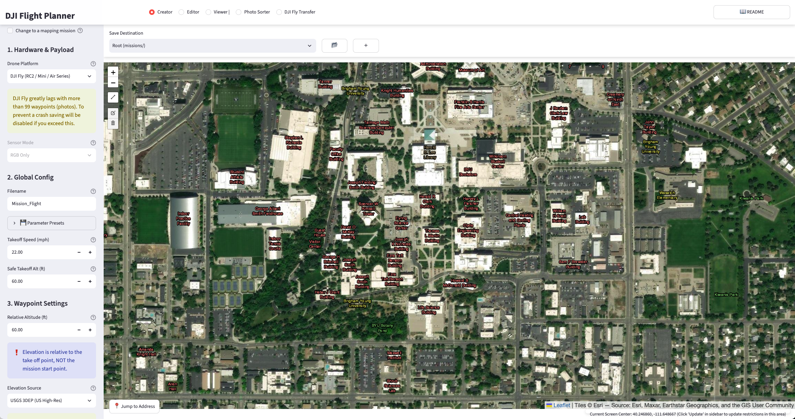
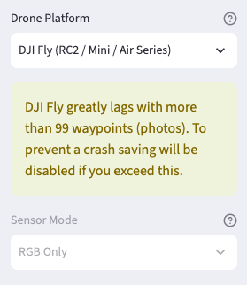
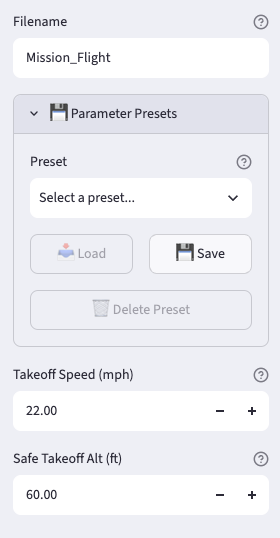
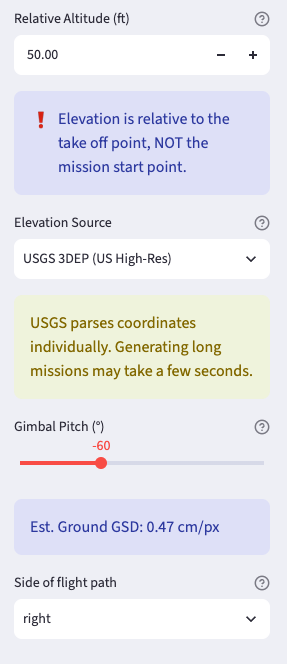
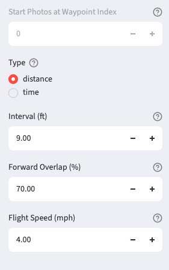
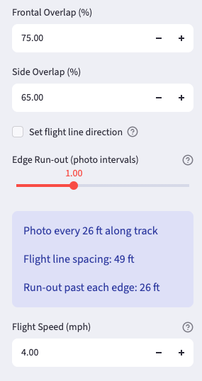
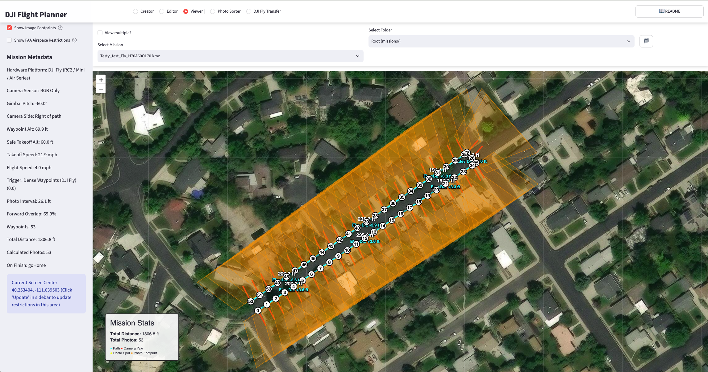
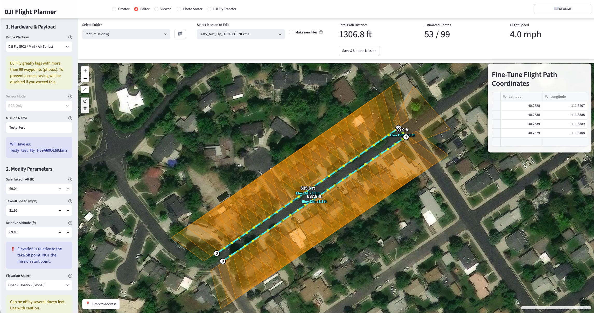
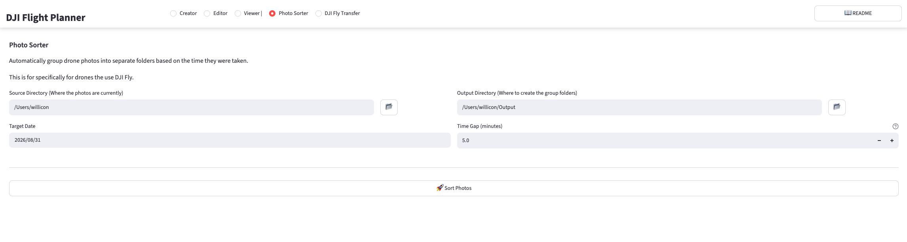
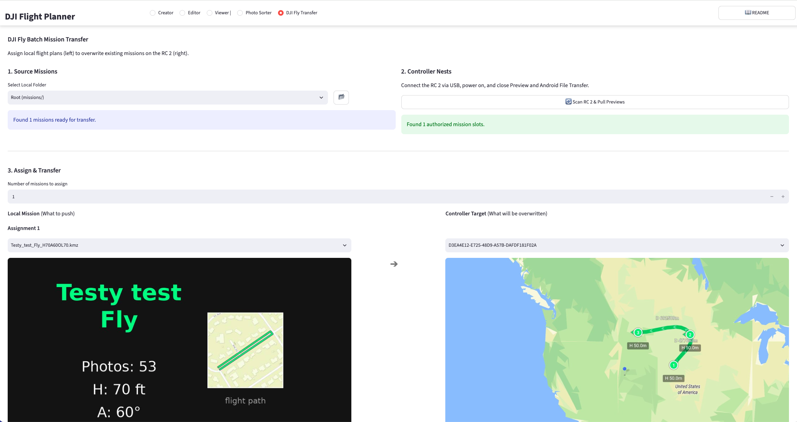

# Flight_planner
An open-source flight planning software for DJI drones. 
Plans can be made for both DJI Pilot 2 (Enterprise) and DJI Fly (Commercial) apps.
Works on both Windows and Mac OS.

## Tabs
The app is split into 5 tabs. Click a tab to jump to its section below.
* [Creator](#the-creator)
* [Editor](#the-editor)
* [Viewer](#the-viewer)
* [Photo Sorter](#photo-sorter)
* [DJI Fly Transfer](#dji-fly-transfer)

## Running the Planner Steps
1. Download this repository.
- Create a new environment. The code uses specific library versions and doesn't work with newer ones. Python 3.11 and 3.12 is confirmed to work. 

2. Install the dependencies with the following code.
```
pip install -r path/to/requirements.txt
```
> **Note**: Update path/to/requirements.txt
> with the relative path to the folder.

> **Note**: On Mac/Linux, the DJI Fly Transfer tab also needs `libmtp` installed as a system library (not a pip package) — `brew install libmtp` on Mac. 
> Without it, that tab's controller detection silently disables itself with no in-app error. 
> Windows doesn't need this; `comtypes` (already in requirements.txt) covers it there.

3. Launch the app by running the following in the terminal. 
The app will open in your web browser using a local host.
```
streamlit run path/to/app.py
```


## Using the Flight Planner
The mission planner is split into three creation tabs: the *Creator*, the *Editor*, and the *Viewer*. 

The *Photo Sorter* and *DJI Fly Transfer* are tabs designed specifically for getting around the restrictions and annoyances that come with the more affordable commercial drone that use the  DJI Fly app. These are explained in a later section. 


### **The Creator**



#### Selecting a Location
Once the app is running, the map will be centered at BYU in Provo, Utah. 
From here, you can scroll out, click, and drag the map to your desired location. 
You may also use the search bar to jump to a specific address or latitude and longitude. 

In the top left corner of the map, select the "Draw a Polyline" icon (line button).
Use the tool to draw your flight plan.
Clicking will create a waypoint. 
Once you have your route finished, click on the last waypoint to finish the line. 
The last two icons on the left will allow you to edit the line or delete the line to start over. 
The flight line must be continuous. 
The app will give you the option to make more, but doing so will mess with the flight plan. 

(And an option to plan cross-area mapping missions is currently present, but needs live testing.)

#### Setting Parameters 
Before or after the line is created, the parameters need to be set. 
These are divided into 5 categories: Hardware, Global Config, waypoint settings, triggers and speed, and visuals. 
All parameters can be found in the scrollable sidebar to the left of the map.
Each is explained in the following sections.

<table>
<tr>
<td width="60%">

##### Hardware & Payload
* **Drone Platform**: DJI Fly or DJI Pilot 2. ❗**THIS OPTION IS VERY IMPORTANT**❗, as it will determine how your flight plan is created.
DJI Pilot 2 works for higher-end enterprise drones/controllers, such as the Mavic Enterprise series.
This option allows for very complicated flight plans with hundreds of photos. 
DJI Fly is the stripped-back version used in the commercial series which doesn't easily support flight plans. 
It is limited to 99 photos per flight plan due to each photo having to be a waypoint. 
*Know which program your drone takes before planning your flight*
* **Sensor Mode**: *Only applies to Multispectral/enterprise drones*. Allows for you to choose between taking RGB, Multispectral, or both kinds of photos per shot. Disabled for DJI Fly flights. 

</td>
<td width="40%">



</td>
</tr>
</table>


<table>
<tr>
<td width="60%">

##### Global Config
* **Filename**: Assign a memorable name. It will also dynamically append the altitude, gimbal pitch, and overlap to the final saved filename as "_HxxAxxOLxx", as well as whether the mission is designed for DJI Pilot 2 or DJI Fly.
* **Parameter Presets**: Save your current parameters (every setting on this sidebar except the Filename) under a name, then reload them later with one click.
Useful if you regularly switch between a couple of different setups, e.g. one altitude/overlap combination for close-up shots and another for wider survey passes.
Presets are saved to your computer and will still be there the next time you open the app.
* **Safe Takeoff Alt (ft)**: The altitude the drone climbs to (relative to takeoff) before flying to the first waypoint. Most often, the default is adequate.
* **Takeoff Speed (mph)**: How fast the drone climbs and transits to the first waypoint. Most often, the default is adequate.

</td>
<td width="40%">



</td>
</tr>
</table>

<table>
<tr>
<td width="60%">

##### Waypoint Settings
* **Relative Altitude (ft)**: This is based on the drone's take-off point, starting at zero.
❗Important❗: Every waypoint will be assigned an elevation relative to the first one, which will be set to this value. 
Thus, the drone should take off as close as possible to the first waypoint.
* **Elevation Source**: Select between Open-Elevation (high error, Global application), USGS 3DEP (Low error, USA only), or Local GeoTIFF files for terrain-following calculations. 
This is very important if your flight plan is not over a flat surface. 
* **Gimbal Pitch (°)**: Angle at which the pictures will be taken. 
* **Side of flight path**: The aircraft takes pictures to the left or right side of the path.
* **Camera side of flight path**: Which way the camera points on a mapping mission.
*parallel* aims it along each pass. 
*right* and *left* aim the camera across the pass to that side.
* **Yaw Side**: Same as Side of flight path, but named for the Editor - the aircraft takes pictures to the left or right side of the path.

</td>
<td width="40%">



</td>
</tr>
</table>

<table>
<tr>
<td width="60%">

##### Trigger & Speed
* **Start Photos at Waypoint Index**: Delays the camera trigger until a designated waypoint is reached. 
0 defaults to the first waypoint.
Only applies to DJI Pilot 2 missions, and is greyed out on DJI Fly: a DJI Fly mission takes one photo at every waypoint from the very first one, so there is no trigger to delay.
* **Type**: By distance or time. Unless you have a specific reason to choose one or the other, use distance. 
* **Interval (ft)**: Distance between photos.
* **Interval (sec)**: Time between photos.
* **Forward Overlap (%)**: How much of one picture will be in the next one. 
This and the interval are connected and will change dynamically based on each other. 
This is also affected by the altitude, but doesn't edit it.
* **Flight Speed (mph)**: Includes auto-calculation for time-based intervals and visual warnings if the speed exceeds the sensor's minimum photo interval. 
4 mph is recommended when following the drone.
* **Set flight line direction**: *Mapping missions only*. 
Off by default, which lets the app pick the direction that needs the fewest flight lines. 
Turn it on when you want the lines pointed a particular way - along crop rows, into the wind, or parallel to a runway or field edge. 
The bearing the app is currently using is shown under the "Passes" count above the map, so you can read it off before switching to manual.
* **Flight Line Bearing (°)**: *Mapping missions only*. 
The compass direction the flight lines run, in degrees clockwise from north: 0 is north-south, 90 is east-west. 
Only 0-179 is offered because the aircraft flies each line in both directions anyway. Expect the pass count (and photo count) to go up compared to the automatic setting - the automatic choice is the cheapest one, so anything else trades photos for a preferred orientation.
* **Edge Run-out (photo intervals)**: *Mapping missions only*. 
How far each flight line continues past the edge of your drawn area, measured in photo intervals, so it scales automatically if you change altitude or overlap. 
The area is fully covered even at 0, because each photo already images half a footprint beyond the aircraft. 
The default of 1 adds one spare frame past each edge, which helps stitching at the borders. 
Raise it if your edges are coming out weak; drop it to 0 to save photos when you are near the DJI Fly 99-photo limit. The resulting distance in feet is shown in the coverage summary.
* **Split passes at gaps (beta)**: *Mapping missions only*. Changes how the flight lines are built. Normally each line runs the full width of the area at that point, so on a shape with a hole or a deep notch - a U, a ring, an H - the aircraft flies straight across the gap.
With this on, each line is cut into only the pieces that are actually inside your shape, and those pieces are flown as separate passes. 
On a deep U this cuts about 20% of the photos. On shapes without a gap it changes nothing at all, so it is safe to leave on. 
It does trade some extra turning for the saved photos, so on a few shapes the total flight distance goes up slightly even as the photo count drops.


</td>
<td width="40%">





</td>
</tr>
</table>

##### Map & Visual Features
* **Show FAA Airspace Restrictions**: Toggles a live ArcGIS overlay showing LAANC grid ceilings.
Use this to know if you need to submit an LAANC report before flying. 
In app submitting is not available, you must use another app to do so.


##### Main Page Features
* **Save Destination**: Located above the map. Use the drop down box to choose an existing mission or the default root "missions/" directory. You can create a new folder by pressing the "+" button, or browse to a custom folder location with the file icon. 
* **Jump to Address/Latlong**: Located at the bottom of the map. Allows you to center the screen on a specific address or latitude and longitude instead of scrolling to it on the map. 


Once your parameters are set and the flight path is drawn, the total path distance and estimated number of photos to be taken will appear above the map.
Save the flight plan by pressing the "save and generate KMZ" button, also found on this line. 

### **The Viewer**



This tab allows the user to view previously made flight plans. 
Features include:

* **Mission select**: Inspect individual or multiple combined flight plans in the viewer.
 These are chosen from either the root "missions" folder or other custom folders. 
* **Flight Path Characteristics**: Arrows displaying the direction of the drone's flight path, the direction of the drone during flight, the distance between waypoints, and the elevation differences between waypoints. 
* **Show Image Footprints**: Projects the camera's field of view onto the map based on altitude, pitch, and drone heading. 
Allows one to get an estimate of the area covered by the drone photos. 
This may be turned on or off with a toggle to the left.
* **Mission Metadata**: View aggregated mission statistics, including total distance and total estimated photos. 
FAA restrictions may also be turned on or off with a toggle to the left.


### **The Editor** 



**DJI_FLY missions are finicky in Editor at the moment**

This tab will allow you to edit previously made flight plans. 
Many of the same parameters in the creator may be edited here, with exceptions noted below. 
Many parts of the viewer can also be seen. 

* **Flight Path**: May be edited using the coordinate data editor table to fine-tune exact latitude and longitude values. 
You can not click and drag the waypoints
* **Make new file?**: May be checked to create a new mission, preserving the old one. 
* **Mission Name**: The name of the flight may be edited from the sidebar, just like the other parameters. 
The suffix for the mission will be reapplied to reflect any changes made to the height, pitch, and overlap. 

## Uploading Missions to a Enterprise Series Drone (DJI Pilot 2)
*(This app comes with the enterprise-tier controllers, such as RC Plus and the RC Pro Smart, and only works with Enterprise series drones)*

This is a relatively simple process. 
First, export your missions from their saved location and place them onto SD card. 
Second, plug this SD card into your controller, navigate to your flight plans, and hit the import button in the top right corner. 
From here navigate through your SD card storage to your flight plans, select all the ones you want, and upload them. 
They are now ready to be used to fly the drone.

## Uploading Missions to a Commercial Series Drone (DJI Fly)
*(This method is currently tested for DJI RC 2 controllers. The phone app is not yet tested, nor a RC controller.)*

As mentioned before, DJI makes it very difficult to upload pre-made flight plans into their commercial drones by heavily locking down their controllers and removing a native import button. 
They also dump all mission images into one general folder, making it difficult to distinguish between different flight plans. 
These issues are circumvented by the *Photo Sorter* and *DJI Fly Transfer* tabs. 


### **Photo Sorter**



This tab allows you to automatically group mission photos into folders based on the times that they were taken. 
It uses the following inputs:'

* **Source Directory**: The location where the drone's image folder is located. 
* **Output Directory**: Where you want the separated mission folders to be saved. 
The folders are saved with the date and time of the first image in the folder. 
* **Target Date**: What date the sorter will look for when grouping missions. 
Only photos taken on this date will be sorted. 
* **Time Gap (minutes)**: How long there needs to be between photos for them to be considered as part of different groups/missions. Accepts fractions of a minute - e.g. 0.5 for a 30 second gap. 


### **DJI Fly Transfer**



This tab allows you to transfer DJI Fly missions to a RC 2 controller directly from your computer. 
It is split into the following sections:

#### 1. Source Missions
Allows you to choose the folder where your missions are located from the root "mission" folder, a created subfolder, or another folder on your computer. 
Choosing a folder will tell you how many missions are DJI_Fly-compatible and are available to be transferred. 

#### 2. Controller Nests
Connect your powered on controller directly to your computer via a USB cable and press the scan button.
 After a few seconds it will tell you how many missions you currently have on the controller, and section 3 will appear. 

If section 3 is not showing, make sure the controller is powered on, and that the preview app (Mac), Android File Transfer tools, and MTP tools are closed and not running.
 These interfere with the connections.  

#### 3. Assign and Transfer
Once a mission folder is selected and the controller is connected, the assign and transfer section will appear. On the left side of the screen is the local missions and on the right the controller missions that will be overridden. At the top of the screen, you can change the number of missions that will be transferred.  

To transfer a mission, first choose the number of missions to be transferred. 
Then, using the dropdown boxes for each assignment, choose the local mission you want to import on the left and what mission on the controller you want to override on the right. 
A thumbnail summary of the mission will appear below both the local and controller missions. 
The controller mission thumbnail will either be the one created by the controller if the mission is not yet overwritten, or the summary thumbnail if previously overwritten.

Due to the restricted nature of the controller software, the names of the controller missions appear as long strings of numbers and letters, and it is impossible to see the name of the mission that the controller displays. 
This makes the thumbnail very important for knowing which mission is what on the controller. 

After all local missions are assigned to a controller mission, press the "Execute Visual Transfer" button on the bottom to upload the missions.

#### Accessing Missions
Viewing downloaded missions on the controller is a little different depending on if you are connected to a drone. 
* **Connected**: On the home screen, press the Blue "GO" button in the bottom right corner. 
This will take you to the camera view.
* **Not Connected**: On the home screen, press the white "connection guide" button in the bottom right corner. 
Then in the top right corner, press "Camera View". 

Once in cammera view, press the waypoint sideway "S" symbol on the middle left of the screen. 
This will pull up the waypoint planner panel on the bottom of the screen. 
Then press the white paper symbol on the left side of the panel, and your History (or flight plan list) will pop up. 

#### Thumbnail Refresh and Checklist
The controller does not automatically update the thumbnails next to the flight missions. 
Since this is one of the only ways to know which mission is which, short of looking at every mission's parameters, these must be updated. 
To update them, in the mission history page, click on a mission to have it load, and then go back to the mission history page and press the save button on the right. 
This will update the thumbnail. 

It is recommended to save and update the thumbnails immediately after transferring the missions. To help keep this straight, at the bottom of the DJI FLY Transfer tab, a checklist is generated showing the old mission thumbnail and the new mission name (along with the long string name). 

## Acknowledgements
- Luigi Pirelli for providing the photo footprint code base. 
- Mavenbridge for inspiring the DJI Fly Transfer Code (No MavenBridge code was used in development).
- Map tiles &copy; Esri &mdash; Source: Esri, Maxar, Earthstar Geographics, and the GIS User Community.
